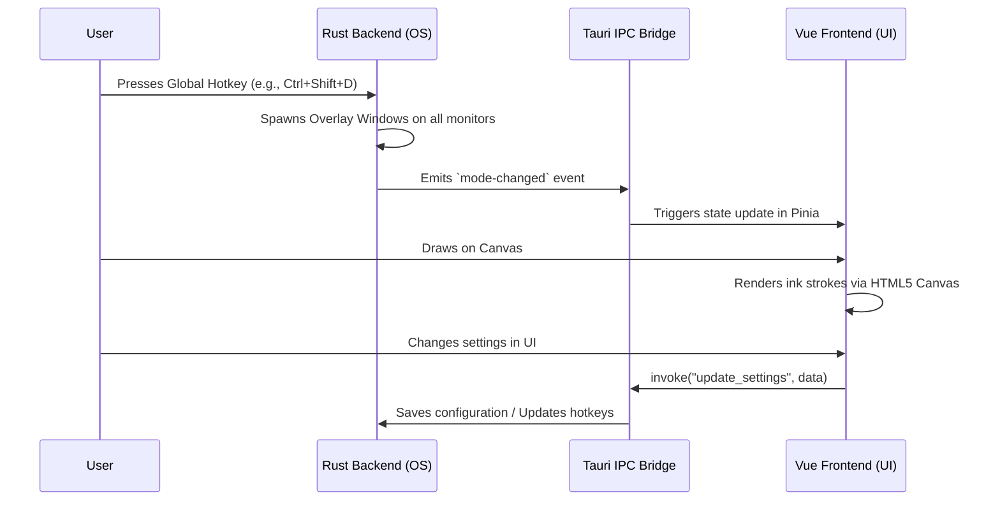

# Architecture Overview

Vynta is a desktop presentation and annotation tool built with **Tauri 2**, featuring a **Rust** backend and a **Vue 3** frontend. The architecture is designed around system-level transparency, multi-monitor support, and efficient GPU-accelerated rendering.

This document explains the architecture and how the system components interact. For deeper dives, see the [Frontend](frontend.md) and [Backend](backend.md) documentation.

## Core Architectural Principles

1. **Multi-Window Isolation**: Instead of a single window, Vynta spawns independent OS-level windows for different tasks (e.g., one for the main settings UI, transparent overlays for drawing, tiny tracking windows for cursor effects).
2. **Shell-Based Routing**: The Vue application does not use a traditional router. Instead, it uses URL query parameters to determine which "Shell" component to mount, allowing the same lightweight frontend bundle to serve various window types.
3. **Cross-Boundary State Synchronization**: State is maintained across the Rust backend (hardware/OS level) and the Vue frontend (UI level) using a combination of Tauri IPC commands, Rust events, and persistent stores.
4. **Performance & Native Integration**: Heavy lifting like screen capture (DXGI, Magnifier API), global hotkey listening, and multi-monitor detection is strictly handled by Rust, leaving the frontend to purely focus on UI and canvas rendering.

## System Components

### 1. Window Management
Vynta's true power lies in its window management strategy:
- **Main Window**: The traditional UI window for settings and configuration.
- **Overlay Windows (Per-Monitor)**: Entirely transparent, click-through windows that span each monitor for drawing annotations.
- **Follow Windows**: Small, borderless windows that update their position every frame to follow the OS cursor (used for Spotlight, Zoom, and Cursor Highlighting).
- **Whiteboard Window**: An opaque window providing a blank canvas.

Each window is instantiated dynamically by the Rust backend (`window.rs`) upon user request or hotkey trigger.

### 2. Frontend Routing (Shell Architecture)
Vynta uses a custom routing mechanism in `App.vue`:

| URL Parameter | Shell Component | Purpose |
|---|---|---|
| `?overlay=true` | `OverlayShell` | Transparent drawing canvas spanning a monitor. |
| `?cursorHighlight=true` | `CursorHighlightShell` | Halo effect following the cursor. |
| `?spotlight=true` | `SpotlightShell` | Darkened screen with a bright circle around the cursor. |
| `?zoom=true` | `ZoomShell` | Magnifying glass lens (supports Live and Freeze modes). |
| `?whiteboard=true` | `WhiteboardShell` | Solid background for drawing. |
| _(none)_ | `AppShell` | Application settings and dashboard. |

### 3. Backend Capture Engines
Vynta implements specialized Rust modules to interact with the Windows OS:
- **DXGI Capture** (`dxgi_capture.rs`): High-performance, GPU-accelerated screen capture.
- **Magnifier API** (`magnifier.rs`): Fallback or alternative zoom engine for better compatibility in certain rendering contexts.
- **Global Hotkeys**: Rust listens globally for shortcuts to toggle modes instantly without the application needing focus.

## Data Flow & IPC (Inter-Process Communication)

Communication between Rust and Vue is facilitated by Tauri's IPC bridge.

### State Persistence
User preferences and application state are managed by **Pinia** on the frontend and persisted to disk using the `tauri-plugin-store`. Critical backend configurations (like the dynamically selected Zoom engine) are queried by the frontend upon initialization.

## Key Technologies Stack

| Domain | Technology | Role |
|---|---|---|
| **Core Framework** | Tauri 2 | Orchestration, IPC, Windowing |
| **Backend Language**| Rust | System APIs, Performance, Memory Safety |
| **Frontend UI** | Vue 3 (Composition API) | Reactivity, Component Architecture |
| **State Management**| Pinia | Centralized store for settings and modes |
| **Screen Capture** | Windows DXGI / Magnifier API | Capturing screen context for Zoom/Freeze |
| **Drawing Engine** | HTML5 `<canvas>` | Low-latency annotation rendering |
| **Styling** | Vanilla CSS | Custom styling, CSS Variables |
| **Icons** | Lucide Vue | Consistent iconography |
